# Diagramas por domínio

Um diagrama por domínio, com as colunas que importam para entender o
relacionamento. O schema completo está em `db/migrations/`.

Convenção: `PK` chave primária · `FK` chave estrangeira · `UK` chave única.
Toda tabela de negócio tem `tenant_id` (omitido nos diagramas para não poluir) e
está sob RLS.

---

## 1. Tenancy e acesso

Rede → unidade → vínculo. O usuário é **global**: o mesmo dentista atende em duas
clínicas de donos diferentes com um login só.

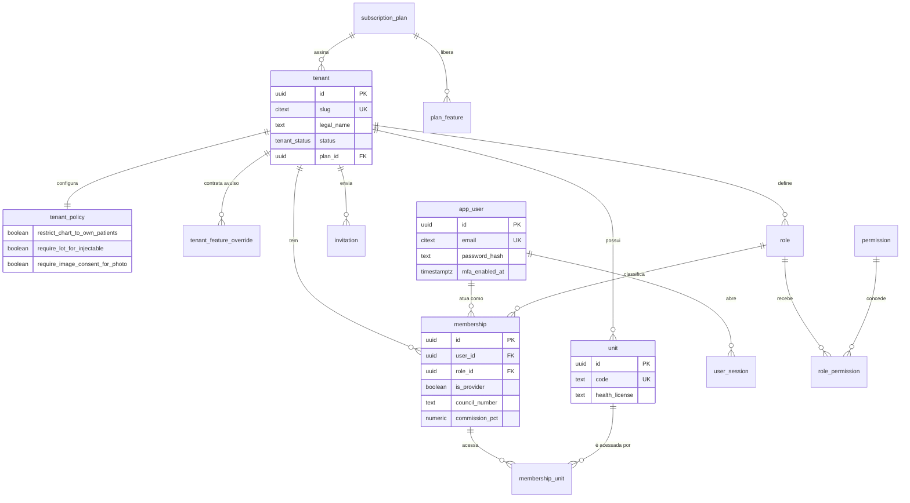

---

## 2. Paciente, consentimento e indicação

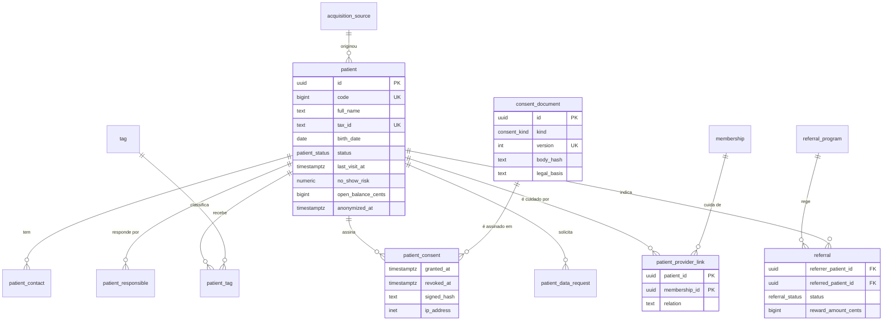

---

## 3. CRM comercial e WhatsApp

**Lead** é a pessoa que ainda não é paciente. **Oportunidade** é o negócio — e
paciente antigo gera nova oportunidade sem virar lead de novo.

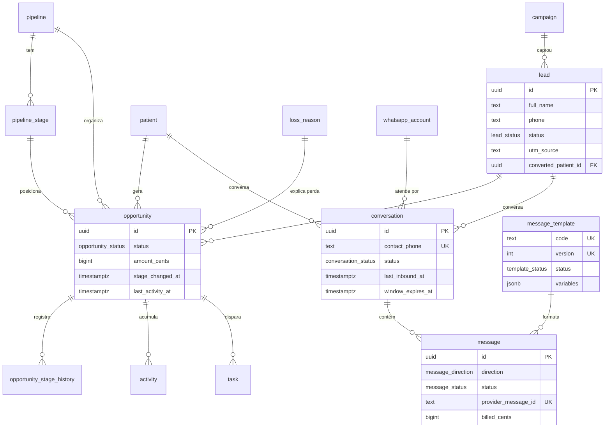

---

## 4. Agenda

Conflito não é validado no app: é `EXCLUDE USING gist` sobre `tstzrange`.

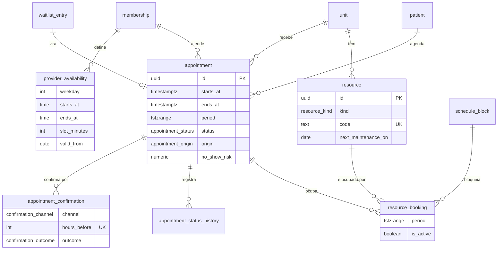

---

## 5. Prontuário

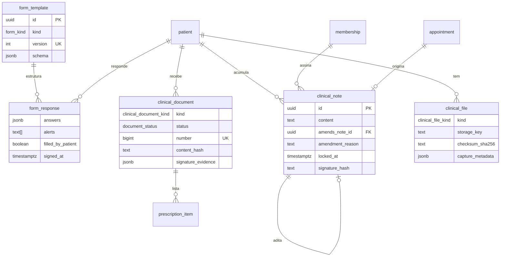

---

## 6. Odontologia

O odontograma é **log de eventos por dente**, não JSON no paciente: cada condição
tem autor, data e origem.

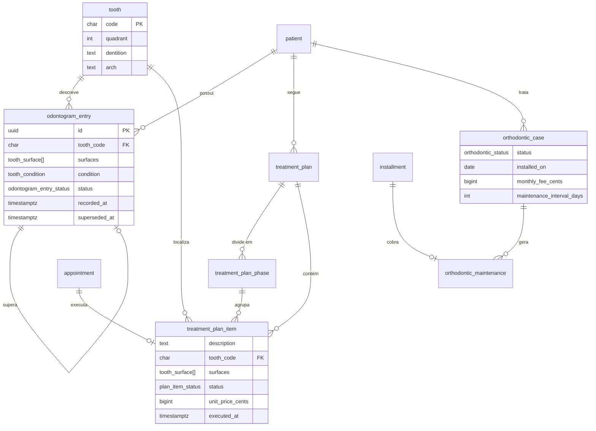

---

## 7. Estética / HOF

`injectable_application` é o coração da rastreabilidade sanitária.

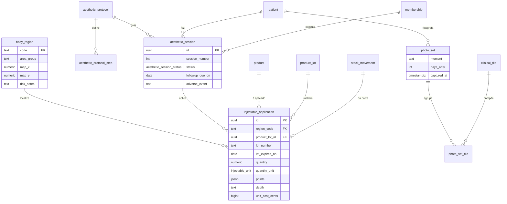

---

## 8. Catálogo, ficha técnica e preço

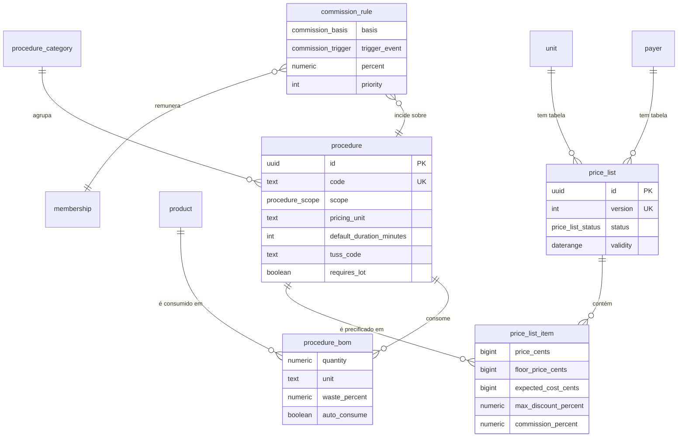

---

## 9. Orçamento

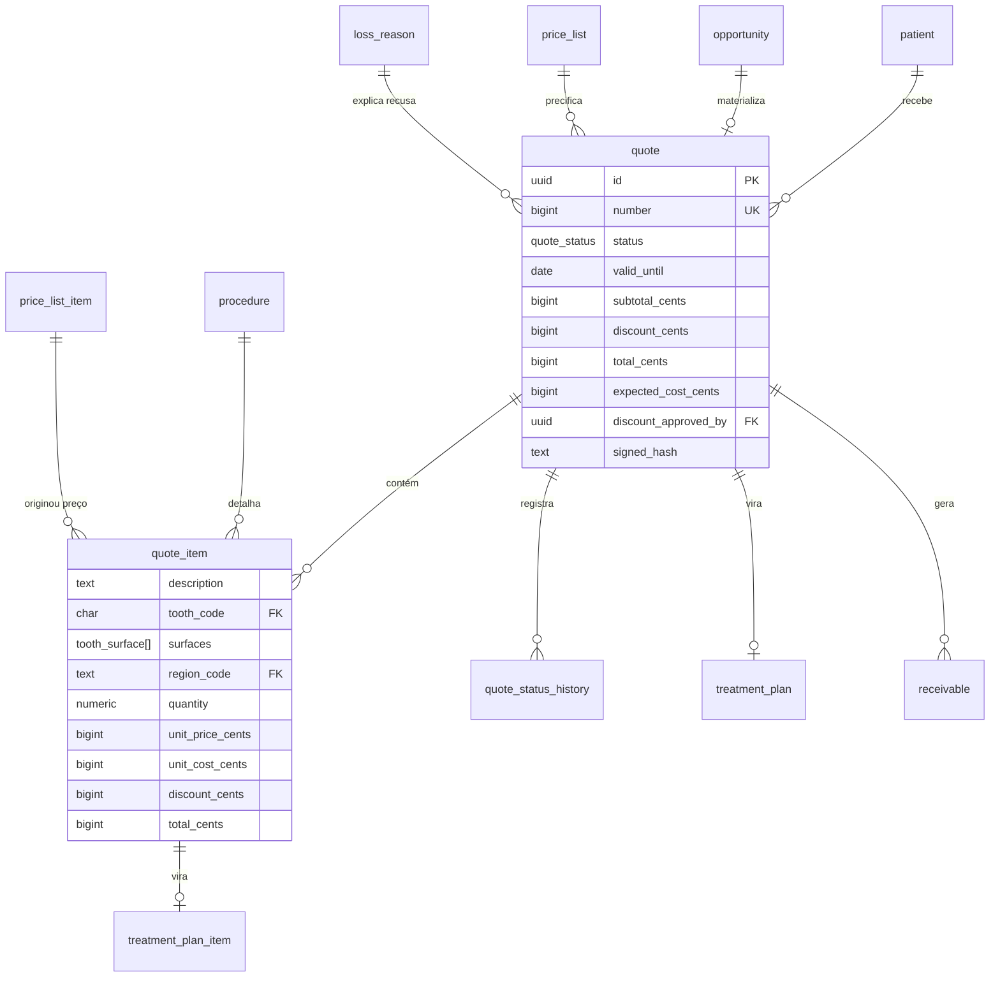

---

## 10. Financeiro

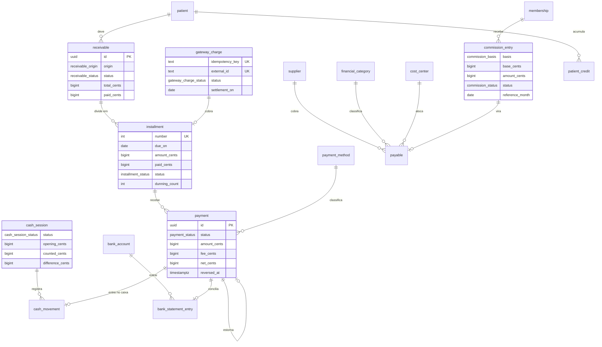

---

## 11. Estoque

Saldo é **derivado**: `stock_movement` é append-only e `stock_balance` é mantido
por trigger.

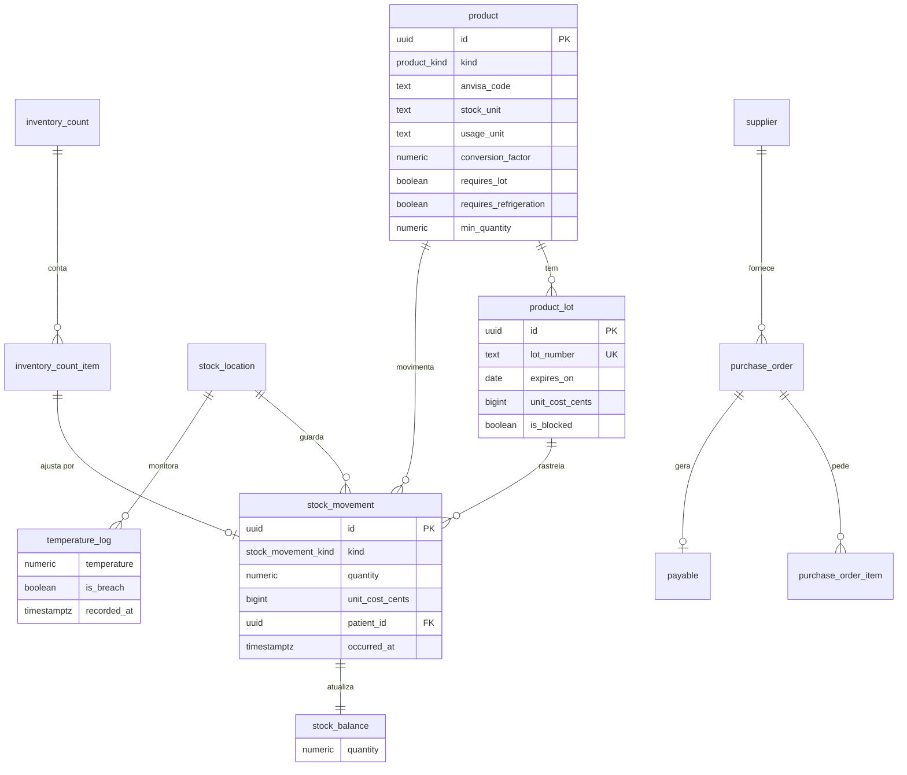

---

## 12. Automação, sinais e métricas

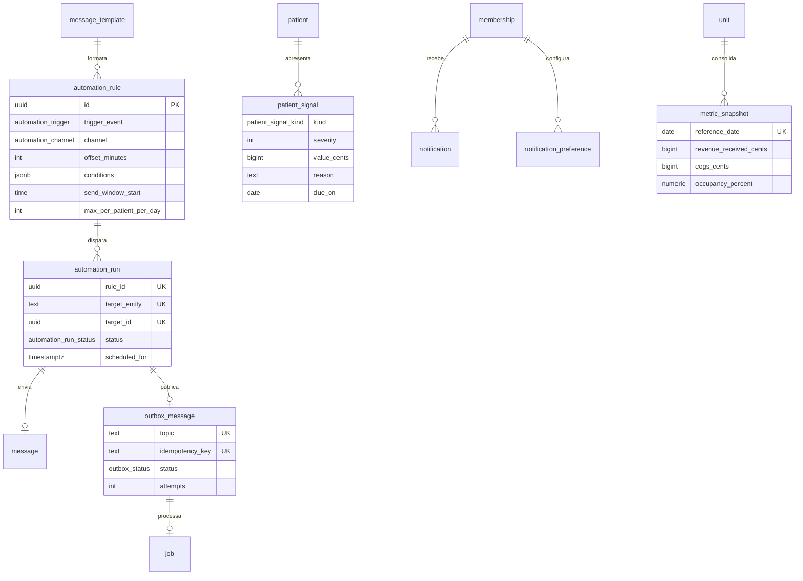
